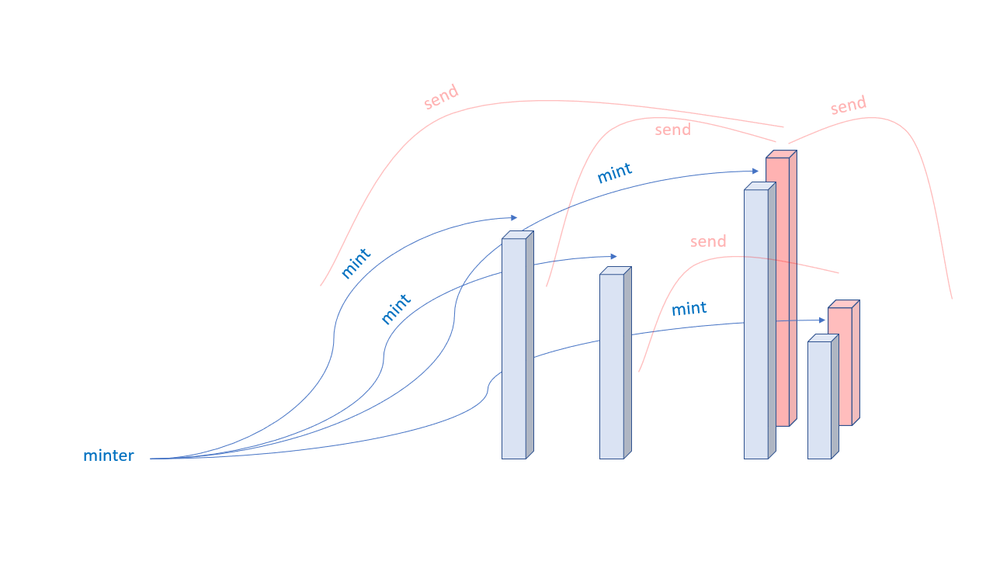

## Introduction to Smart Contract

### A simple Smart Contract

Let us begin with a basic example that sets the value of a variable and exposes it for other contracts to access.

Storage Example

```solidity
// SPDX-License-Identifier: MIT
pragma solidity >=0.4.16 <0.9.0;

contract SimpleStorage {
    uint256 storedData;

    function set(uint256 x) public {
        storedData = x;
    }

    function get() public view returns (uint) {
        return storedData;
    }
}
```


The first line tells you that the source code is licensed under the MIT version. Machine readable license specifiers are important in a setting where publishing the source code is the default.

The next line specifies that the source code is written for Solidity version 0.4.16, or a newer version of the language up to,  but not including version 0.9.0. This is to ensure that the contract is not compatible with a new (breaking) compiler version, where it could behave differently. Pragmas are common instructions for compilers about how to treat the source code.

A contract in the sense of Solidity is a collection of code (its function) and data (its state) that resides at a specific address on the Ethereum blockchain. The line `uint storedData;` declares a state variable called `storedData` of type `uint` (unsigned integer of 256 bits). You can think of it as a single slot in a database that you can query and alter by calling functions of the code that manages the database. In this example, the contract defines the functions `set` and `get` that can be used to modify or retrieve the value of the variable.

To access a member (like a state variable) of the current contract, you do not typically add the `this.` prefix, you just access it directly via its name. Unlike in some other languages, omitting it is not just a matter of style, it results in a completely different way to access the member, but mor on this later.

This contract does not do much yet apart from (due to the infrastructure built by Ethereum) allowing anyone to strore a single number that is accessible by anyone in the world without a (feasible) way to prevent you from publishing this number. Anyone could call `set` again with a different value and overwrite your number, but the number is still stored in the history of the blockchain. Later, you will see how you can impose access restrictions so that only you can alter the number.

### Subcurrency Example

The following contract implements the simplest form of a cryptocurrency. The contract allows only its creator to create new coins (different issuance schemes are possible). Anyone can send coins to each other without a need for registering with a username and password, all you need is an Ethereum keypair.

```solidity
// SPDX-License-Identifier: MIT
pragma solidity ^0.8.26;

// This will only compile via IR
contract Coin {
    // The keyword "public" makes variables
    // accessible from other contracts
    address public minter;
    mapping(address => uint) public balances;

    // Events allow clients to react to specific
    // contract changes you declare
    event Sent(address from, address to, uint amount)

    // Constructor code is only run when the contract is created
    constructor() {
        minter = msg.sender;

    }

    // Sends an amount of newly created coins to an address
    // Can only be called by the contract creator
    function mint(address receiver, uint amount) public {
        require(msg.sender == minter);
        balances[receiver] += amount;
    }

    // Errors allow you to provide information about
    // why an operation failed. They are returned
    // to the caller of the function
    error InsufficientBalance(uint requested, uint available);

    // Sends an amount of existing coins
    // from any caller to an address
    function send(address receiver, uint amount) public {
        require(amount <= balances[msg.sender],InsufficientBalance(amount, balances[msg.sender]));
        balances[msg.sender] -= amount;
        balances[receiver] += amount;
        emit Sent(msg.sender, receiver, amount);
    }
}
```



